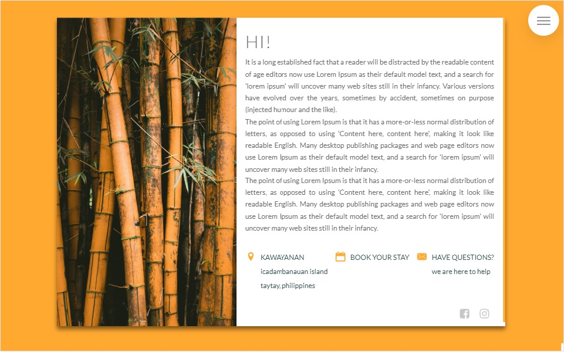

## Hii! I'm Marta! 👋
### Let me present you some of my projects you can find on my GitHub:
 

#### Kawayanan - the island resort project :palm_tree:

*This project was mainly focused on CSS (Sass in perticular) to create eyepleasing hotel-retreat website*  
To see more, please visit: https://github.com/grumart/kawayanan 

 

#### Cat Angels - cat shelter project :smiley_cat:

*In this project I'm using React.js to focus on components and rendering content using informations stored in seperate JS file (could be also json file in DB)*  
To see more, please visit: https://github.com/grumart/Cat-Angels-React

 

#### BurgerApp - applicatioon to order custom made burgers (done doing React.js course) :hamburger:

*The most challenging and satisfying project of all listed above. A lot of JS using: React.js, Firebase, Redux and Axios. *  
To see more, please visit: https://github.com/grumart/Burger-App

 
 

### Little about me as a web developer:
 
<b>Courses-holic</b> After a decision to change my career to web development, completed multiple courses to gain the knowledge and confidence to write good quality (and working!) code. Learning online has thought me self-discipline, searching for additional explanations on MDN or Stackoverflow if some of the parts weren't quite clear at the beginning, and using * documentation * in new to me libraries :wink: .   
<b>Fascinated by the power of JavaScript</b> We all love and admire beautifully designed web pages or apps. We all do. But there is nothing better than functionality that actually works and gives you the desired output. Either ordering something online, getting geolocation, connecting to database - that's the true magic. Together with React, this will be my main focus in upcoming career :woman_technologist: .   
<b>Never-ending learing journey</b> That was the main factor which has drawn me to this industry. Self-development. There is always something new to learn, another language, getting familiar with a package or library. Maybe back-end someday? Who knows! :brain:   

### If you have come this far, you must like it! Thank you for that! I'm ready to obtain a profesional experience, so if you'd like me on your team, please let me know! :bowtie:

